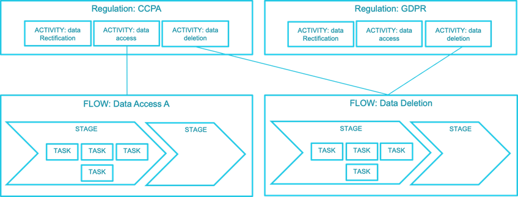

# K2View DPM Overview

The Data Privacy Management module provides a company with the tools it requires to configure, manage, and audit the data subject requests which are associated with data privacy regulations such as GDPR, CCPA, LGPD, and many others.

K2View’s DPM is a configurable, flexible system which allows each company to define the regulations it supports, the types of requests to which it attends, procedures for fulfilling each request, and other aspects associated with compliance to the various Privacy legislations.

## K2View’s DPM is composed of two main modules: 

<u>**Admin module**</u>: The Admin module is used by the DPM Administrator for the configuration of the system. Through this module the Administrator can define all Data Privacy Management aspects, such as the supported regulations, the types of requests that can be made for each regulation, the task flow required to fulfill each request, consent configuration, and more. such as the supported regulations, which type of requests can be made for each regulation, what is the task flow required for the fulfilment of each request, consent configuration, and more. 

**<u>Data subject requests and consent management:</u>** Role-based modules that serve different users, such as:

- Call Center Representatives, who handle the submission of data requests
- Data Stewards, who fulfill those requests
- Case Owners, who are responsible for the successful completion of the requests under their responsibility
- Supervisors, who control the allocation of Requests to Case Owners

These components cover the end-to-end life cycle of data privacy-related requests, from the submission of a new request, request fulfilment process, SLA management, management dashboards, and generation of audit data. In the next chapters this user guide describes in detail the functionality of each of the modules. 

## Main DPM Entities

The DPM configuration is based on the following main entities: 

·     **Regulation** – DPM flexible configuration allows compliance with any current or future regulation, such as GDPR, CCPA, LGPD, or any other. There is no limit on the number of regulations supported. 

·     **Activities** – Under each regulation a set of Activities is defined. Each Activity represents an action that the customers can request as part of the Data Privacy legislation. For example, an Activity may be a request to get the customer data or a request to delete the customer data. There is no limit on the nature or number of Activities that can be configured 

·     **Flow** – a Flow is a set of stages that should be executed in order to fulfill an Activity. Each Activity entity is linked to a Flow that is responsible to execute the process to perform the relevant customer request. A Flow can be used in multiple Activities. For example, if the Activity is “Request My Data,” and it can be executed in the same way ,regardless of which privacy legislation the customer is under then the same flow will be linked to all Activities (whether the legislation is GDPR, CCPA, or any other).

·     **Stage** – A Stage is the building block of a Flow. Each Flow has at least one Stage. The Stages are executed in sequence one after the other.

·     **Task** – Task is the lowest level of action that is defined in the Admin. It typically performs one specific Activity, such as: check request validity, send an e-mail to the customer, or gather customer data. Each Stage includes one or more Tasks. Tasks can be defined to be executed in parallel or in sequence. Once all the Tasks of a specific Stage are completed, then the next Stage will start.

An example of the relation between the above entities is depicted in the following diagram: 

​                           

