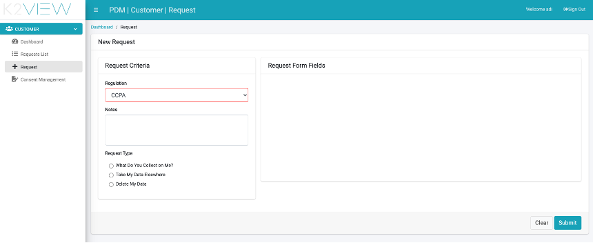
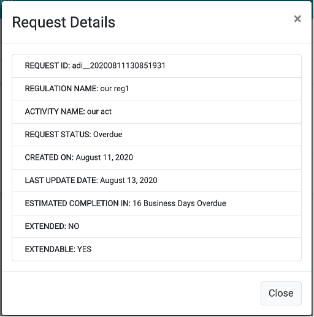

# CUSTOMER DIRECT REQUESTS

The DPM system provides different ways to allow a customer to submit a DPM request, search for a request previously submitted and view its details:

- DPM includes built-in user interface for the use of a customer.
- DPM provides a set of APIs that can be integrated in the customer portal of each corporate that uses the system. 

## DPM Customer’s built-in user interface

DPM includes a set of screens that allow a customer to submit DPM Requests, as well as view his own request’s details.

### Customer Dashboard

When a customer logs into the DPM user interface, the initial screen that is presented is the customer’s Dashboard screen, which includes the following items:

- Submit a new request button: the option to submit a request.
- Open Requests: the number of requests that are in processing for this customer.
- View Requests: view the list of this customer’s requests.

 

The same options can be reached also from the menu items on the left side of the screen.

### Customer submits a request

When a customer selects the option to create a new request, the system directs the customer to a screen where the request details are collected. The list of requests type and the information that should be provided for each of them is defined by implementation using the Admin module. 

 

When submitting a new request, the customer first selects the relevant regulation out of the Regulation dropdown list. 
The customer can add notes to the Request before submitting it. 
The list of Request Types options that is presented at the bottom of the submission form changes according to the selected Regulation.
Once the Request type is selected, the right side of the form presents the list of fields that should be completed before submitting the request. This list is automatically built in accordance with the Request type. 

<table>
<tbody>
<tr>
<td width="100">

<strong>Field</strong>

</td>
<td width="800">

<strong>Description</strong>

</td>
</tr>
<tr>
<td width="100">

Regulation

</td>
<td width="800">

The Regulation that applies to the customer that is asking to submit a request.

</td>
</tr>
<tr>
<td width="100">

Notes

</td>
<td width="800">

Free text. Comments that the customer would like to be registered as part of the request.

</td>
</tr>
<tr>
<td width="100">

Request Type

</td>
<td width="800">

The specific Request that should be submitted. The options in this section depend on the selected Regulation.

</td>
</tr>
<tr>
<td width="100">

Request Form Fields

</td>
<td width="800">

Depending on the selected Request Type, different fields will be presented in this section, and the customer should populate them before submitting the request.

</td>
</tr>
</tbody>
</table>

The customer number is not requested when submitting the request, since the customer had already provided this identification when entering the system. 

### Customer view requests  

The customer can view his own requests by either selecting the “Requests List” menu option, or by clicking the “View Requests” options on the Dashboard. 
The requests that are presented include both completed requests as well as requests that are still in-progress.

 

<table width="594">
<tbody>
<tr>
<td width="103">

<strong>Column</strong>

</td>
<td width="491">

<strong>Description</strong>

</td>
</tr>
<tr>
<td width="103">

Request ID

</td>
<td width="491">

The unique identification of the request.

A progress bar is displayed below the Request ID. This progress is calculated based on the Request open date and the SLA for this request. It is presented in green as long as the Request is within the SLA period (or extension period), and in red if the Request is overdue.

</td>
</tr>
<tr>
<td width="100">

Regulation

</td>
<td width="800">

The Regulation that this request was created for.

</td>
</tr>
<tr>
<td width="100">

Activity

</td>
<td width="800">

The Activity that this Request executes.

</td>
</tr>
<tr>
<td width="100">

Status

</td>
<td width="800">

The Request status. Values may be: In Progress, Overdue, Completed, Stopped. A Stopped Request is a Request that during its execution the system identified it should stop the execution. For example, if there is a validation that the same customer cannot open two equal Requests, and there is already another Request for this same customer and Activity which is still in progress

</td>
</tr>
<tr>
<td width="100">

Created

</td>
<td width="800">

The date and time that the Request was submitted.

</td>
</tr>
<tr>
<td width="100">

Completed

</td>
<td width="800">

The date and time that the Request was completed (completed requests only).

</td>
</tr>
</tbody>
</table>

Further details about a specific request can be viewed by clicking the request row:

 

<table>
<tbody>
<tr>
<td width="100">

<strong>Field</strong>

</td>
<td width="800">

<strong>Description</strong>

</td>
</tr>
<tr>
<td width="100">

Request ID

</td>
<td width="800">

The unique identification of the request.

</td>
</tr>
<tr>
<td width="100">

Regulation name

</td>
<td width="800">

The Regulation that this request was created for.

</td>
</tr>
<tr>
<td width="100">

Activity name

</td>
<td width="800">

The Activity that this Request executes.

</td>
</tr>
<tr>
<td width="100">

Request Status

</td>
<td width="800">

The Request status.

</td>
</tr>
<tr>
<td width="100">

Created on

</td>
<td width="800">

The date and time that the Request was submitted.

</td>
</tr>
<tr>
<td width="100">

Last Update Date

</td>
<td width="800">

The last time this request was updated. The Request is updated as its execution is progressing &ndash; so this date indicates the last date that a Task was executed in the Flow that is fulfilling this Request.

</td>
</tr>
<tr>
<td width="100">

Estimated completion in

</td>
<td width="800">

The number of days till the request is expected to be completed. The number of days is calculated based on the Request creation date and the Activity SLA.

</td>
</tr>
<tr>
<td width="100">

Extended

</td>
<td width="800">

Indicates if the Request SLA was extended. The values are true/false.

</td>
</tr>
<tr>
<td width="100">

Extendable

</td>
<td width="800">

Indicates if the Request SLA can be extended. This depends on the configuration of the Activity of this task.

</td>
</tr>
</tbody>
</table>

## DPM APIs for customer requests

For companies that prefer to integrate the DPM requests in their own customer portal using their standard user interface design, DPM provides a set of APIs to be used by any client application.  
For detailed documentation of those APIs access the swagger documentation of the DPM system.

