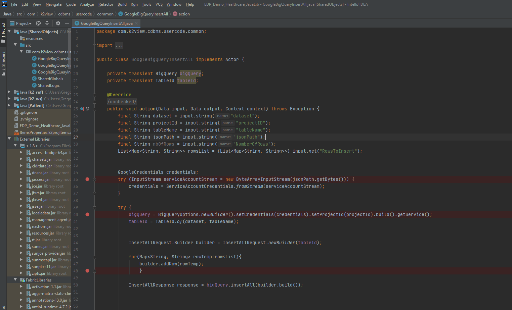
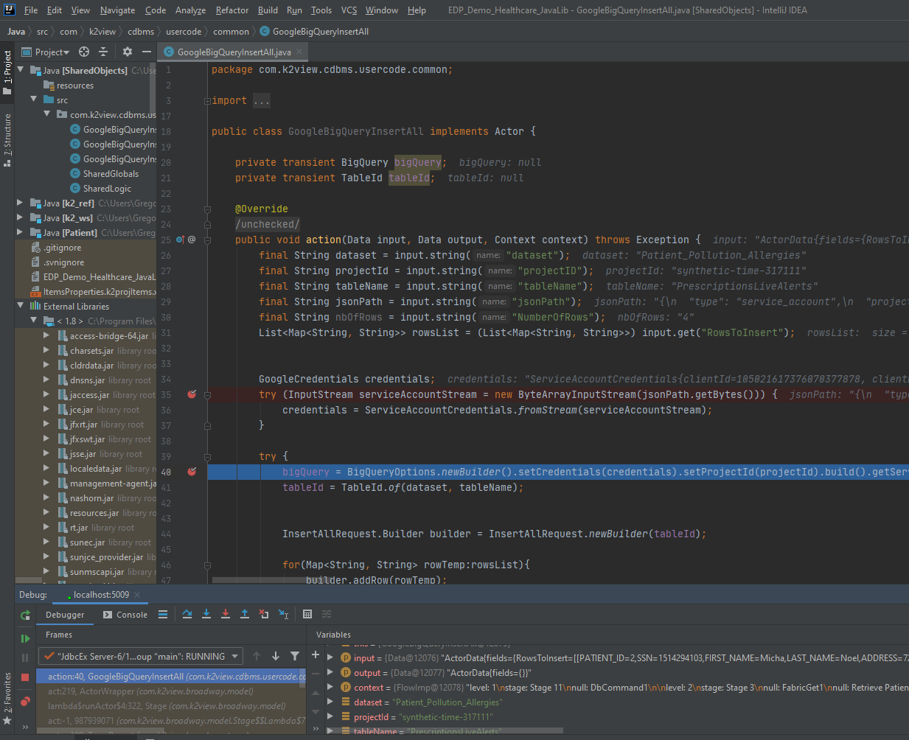

# Debugging with IntelliJ

There are a range of key-features offered by IntelliJ IDEA that lets you accelerate your implementation. In this article, we will focus on Fabric Java project debugging capabilities.


## Debugging

Refer to the following links to set up a simple Java debugging scheme on your project:
- [Set breakpoints]( https://www.jetbrains.com/help/idea/debugging-your-first-java-application.html#setting-breakpoints)
- [Run in debug mode]( https://www.jetbrains.com/help/idea/debugging-your-first-java-application.html#running-program)
- [Analyze and Step through]( https://www.jetbrains.com/help/idea/debugging-your-first-java-application.html#analyzing-state)
- [Stop and Re-run]( https://www.jetbrains.com/help/idea/debugging-your-first-java-application.html#stopping-debugger)

## Step-through Debugging Example

1. Open the Java file you wish to debug in IntelliJ.

2. Select the lines on which to add the breakpoints  - see the red bullets below next to the line numbers. 

 
3. Select the **Run -> Attach to Process** option from the menu bar.  

 
4.	Select the process to which to attach the Java debugger - for example in the screenshot displayed below, the ```26972 com.k2view.fabric.boot.Boot (5009)``` option is selected.

 
5. Run your code and step through the program’s breakpoints using the controls on the left side of the [debug window](https://www.jetbrains.com/help/idea/debugging-your-first-java-application.html#stepping)



[](/articles/04_fabric_studio/04a_IntelliJ/03_intelliJ_from_fabric_studio.md)
