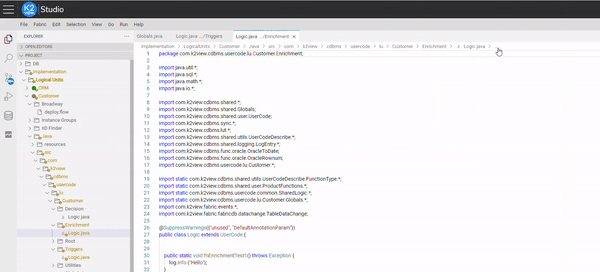

<web>

# Exploring, Navigating and Managing Files

This article explains how to explore files and their contents in the Fabric Studio, at project tree explorer and other utilities.

 

Fabric Studio is file and folder based and to explore your project it is recommended to open the Explorer View (opened by default) - the top most at the activity bar. The explorer, appears at the side bar, contains two sub-views - the Project and the Open Editors.

## Project Explorer

The Project Tree explorer is used to browse, open, and manage files and folders in your project. 

After expanding a folder, the contents of the folder are shown in the Explorer. You can do various things from here:

* Create, delete, and rename files.
* Use the context menu to explore all options.

>**Tips:** 
>
>1. You can drag and drop files into the Explorer from outside Fabric Studio to copy them.
>2. A badge appears on the Explorer icon at the Activity Bar showing how many files are currently being edited and have not yet been saved.

### Multi-selection

You can select multiple files in the **File Explorer** and its **OPEN EDITORS** sub-view to run actions (such as Delete or Open) on multiple items. Use the `Ctrl/Cmd` key with `click` to select individual files and `Shift` + `click` to select a range. 

> **Tip:** If you select two items, you can now use the context menu **Compare with Each other** command to quickly diff two files.

### Filtering the document tree

You can type to filter the currently visible files in the **File Explorer**. With the focus on the **File Explorer** start to type part of the file name you want to match. You will see a filter box in the top-right of the **File Explorer** showing what you have typed so far and matching file names will be highlighted. When you press the cursor keys to move up and down the file list, it will jump between matching files or folders.

Hovering over the filter box and selecting **Enable Filter on Type** will show only matching files/folders. Use the 'X' **Clear** button to clear the filter.

>**Note**: While filtering is applied also on folders, moving up and down keys to navigate to the location in tree is relevant for files only.

### Open Editors

At the top of the Explorer is a sub view labeled **OPEN EDITORS**. This is a list of active files. These are files you previously opened and you are working on. 

## Search

* You can also type `Ctrl+P` to search and open files by their name. 

- To search for files contents use the Search View, accessible from the Activity Bar . You can open to the Search View also by using the  `Ctrl+Shift+F` shortcut. To learn more about using the Search tool within the Web Studio see [here](22_web_search.md).

## Outline

Once a file is opened you can navigate inside according to its outline. For example, in Java code the outlines represents as functions that you can move from one to another.

Outline can be opened as a right side panel, by clicking on the  icon. Outline can be opened and closed also by using the shortcut: `CTRL+SHIFT+I`.

File's outline can be revealed by clicking on the 3 dots ellipsis appears at the right of the file name

## Breadcrumbs

The Editor panel has a navigation bar above its contents called [Breadcrumbs](https://en.wikipedia.org/wiki/Breadcrumb_(navigation)). It shows the current location and allows you to quickly navigate between folders, files, and symbols.

Breadcrumbs always show the file path and if the current file type has language support for symbols, the symbol path up to the cursor position. For example, Java files will be signed with Java icon near by their name.

