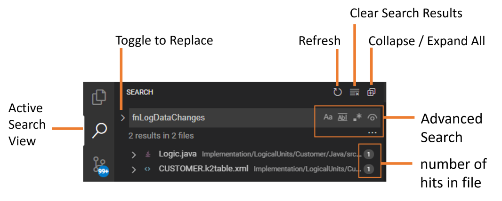

<web>

# Search 

The Fabric Web Studio allows you to quickly search terms and content over all files in the project.  Press `⇧⌘F / CTRL+Shift+F` or the Search icon at the Activity Bar to get into The Search View where you can enter your search term. Search results are grouped into files containing the search term, with an indication of the hits, i.e. occurrences, in each file and its location. Expand a file to see a preview of all of the hits within that file. Then single-click on one of the hits to view it in the editor.

>**Tip:** You can also use regular expressions in the search box.

### Advanced search options

You can use the advanced search options which appear nearby the search box on the right, in addition to others which can be revealed by clicking the ellipsis (**Toggle Search Details**) .

The Search Widget also has four advanced search options:

- Match Case
- Match Whole Word
- Regular Expression
- Include Ignored Files

Clicking on the ellipsis (**Toggle Search Details**) will show additional fields below the search box, which are used to configure the search.

In these two input boxes you can enter patterns to include or exclude from the search. Use `,` to separate multiple patterns. Paths must use forward slashes. You can also use [glob wildcard syntax](https://en.wikipedia.org/wiki/Glob_(programming)):

* `*` to match one or more characters in a path segment
* `?` to match on one character in a path segment
* `**` to match any number of path segments, including none
* `{}` to group conditions (for example `{**/*.html,**/*.txt}` matches all HTML and text files)
* `[]` to **declare** a range of characters to match (`example.[0-9]` to match on `example.0`, `example.1`, …)

### Search and replace

You can also Search and Replace across files. Expand the Search widget to display the Replace text box.

When you type text into the Replace text box, you will see a diff display of the pending changes. You can replace across all files from the Replace text box, replace all in one file or replace a single change.

</web>
