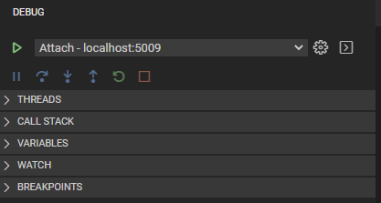
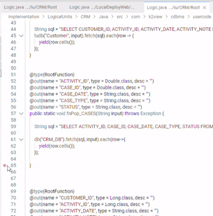
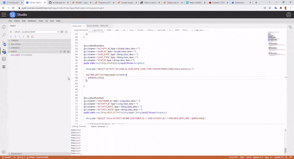

<web>

# Code Debugging

One of the key features of the Fabric Web Studio is its debugging support. The built-in debugger helps accelerate your edit, compile and debug loop.

> Note: This article covers code debugging. you can find [here]() information about Broadway debugging.

## Debug View

To bring up the Debug View, select the Debug icon in the **Activity Bar** on the side of Web Studio. You can also use the keyboard shortcut `CTRL+SHIFT+D`.

The Debug View displays all information related to running and debugging. 

It built from:

* A top bar with debugging Attach command and configuration settings.
* Debug Actions panel (Continue / Pause, Step Over, Step Into, Step Out, Restart, Stop).
* Data Inspection sections (THREADS, CALL STACK, VARIABLES, WATCH, BREAKPOINTS) which provides variety of data. 

## Breakpoints

Breakpoints can be toggled by clicking on the **editor margin** or using `F9` on the current line. In addition, use right-click to set a conditional breakpoint (by expression, hit count or log message). Finer breakpoint control (enable/disable/set condition) can be done in the Debug View's **BREAKPOINTS** section.

* Breakpoints in the editor margin are normally shown as red filled circles.
* Disabled breakpoints have a filled gray circle.
* When a debugging session starts, breakpoints that cannot be registered with the debugger change to a gray hollow circle. The same might happen if the source is edited while a debug session without live-edit support is running.

## Logpoints

A Logpoint is a variant of a breakpoint that does not "break" into the debugger but instead logs a message to the console. Logpoints are especially useful for injecting logging while debugging production servers that cannot be paused or stopped.

A Logpoint is represented by a "diamond" shaped icon. Log messages are plain text but can include expressions to be evaluated within curly braces ('{}').

Just like regular breakpoints, Logpoints can be enabled or disabled and can also be controlled by a condition and/or hit count.

When debug is running, a Debug Console is opened at bottom panels area, where these logpoints are printed.

## Data inspection

Variables can be inspected in the **VARIABLES** section of the Debug View or by hovering over their source in the editor. Variable values and expression evaluation are relative to the selected stack frame in the **CALL STACK** section.

Variable values can be modified with the **Set Value** action from the variable's context menu. Additionally, you can use the **Copy Value** action to copy the variable's value, or **Copy as Expression** action to copy an expression to access the variable.

Variables and expressions can also be evaluated and watched in the Debug View's **WATCH** section.

Variable names and values can be filtered by typing while the focus is on the **VARIABLES** section

## Advanced breakpoint topics

### Conditional breakpoints

A powerful VS Code debugging feature is the ability to set conditions based on expressions, hit counts, or a combination of both.

- **Expression condition**: The breakpoint will be hit whenever the expression evaluates to `true`. A conditional breakpoint is represented by an "equal" shaped icon. 
- **Hit count**: The 'hit count' controls how many times a breakpoint needs to be hit before it will 'break' execution. Whether a 'hit count' is respected and the exact syntax of the expression vary among debugger extensions.

You can add a condition and/or hit count when creating a source breakpoint (with the **Add Conditional Breakpoint** action) or when modifying an existing one (with the **Edit Condition** action). In both cases, an inline text box with a dropdown menu opens where you can enter expressions.

Condition and hit count editing support is also supported for **function** and **exception** breakpoints.
You can initiate condition editing from the context menu, or the new inline **Edit Condition** action.

Below is an example of setting and activating an Expression Condition. The condition was set like that the debug execution stops at the breakpoint only when a CASE's status at "CASES" table is equal to "Open" (the used conditional expression is: `row.cell(4).equals("Open")`).

</web>
