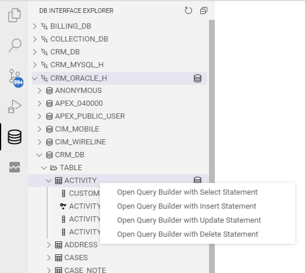
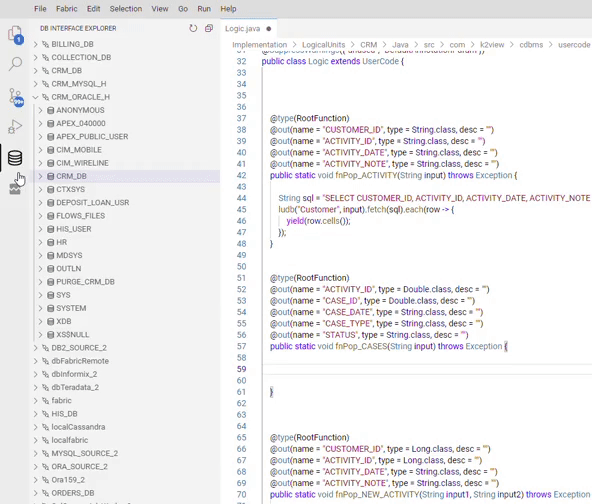
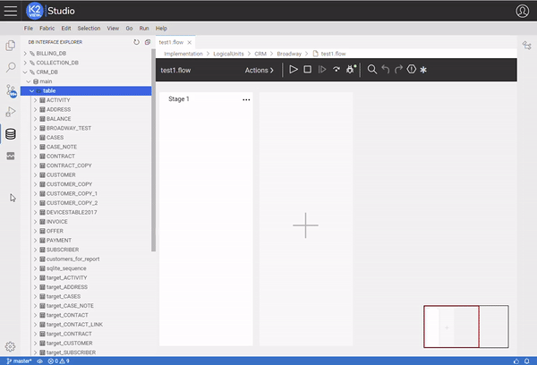

<web>

# DB Interface Explorer

DB Interface Explorer View lets you exploring the project's data source - the DB interfaces, as well as fabric, and make actions along the Studio editors. 

To bring up the Debug View, select the DB Interface Explorer icon in the **Activity Bar** on the side of Web Studio.

 


The view shows the project's DB interfaces list in a tree form. You can then expand each entry in the list to explorer schemas, tables, views, and columns, according to each database type structure and its hierarchy.

According to the opened editor's context you can apply actions, like: executing SQL queries at Query Builder, adding DB statements to Fabric functions, adding DB actors to Broadway and adding an SQL section to Graphit.

Choose the required SQL statement by using context menu (right click) on relevant tree entry. The available statements are:

* *select* statement.
* *insert* statement.
* *update* statement.
* *delete* statement.

> Note: You can also choose specific table's fields so that the query will contain only those fields.


Following are the actions you can make with the DB Explorer View:

## Open the Query Builder

When no editor is opened, then you can examine the source data and execute SQL statement in the Query Builder (QB). Select the DB Interface or any table under it on the tree, and choose the required SQL statement to open the QB the right main panel.

To open the Query Builder you can also click the DB icon appears near their names. Clicking on that icon resides near the table will auto open a select statement on it, at the Query Builder Editor panel.

> Notes:
>
> 1. The DB icons let you to open the Query builder also when other editors, such as Java, Broadway or Graphit, are opened.
> 2. If you choose entities of a DB Interface where a Query Builder is already opened on another Interface, then another Query Builder tab will be opened. This will let you make queries on more than single interface on the same time.


 


## Add SQL statements to Fabric functions

When a Java file editor is opened and is in focus, you can right click to open the context menu and add code snippet of the SQL statement, for the selected table, using Fabric *fetch* helpers.

In the following illustrated example, specific columns from CASES table are selected at the DB Explorer. Then, using the right click context menu - the appropriate Java select statement code is added

```java
    String sql = "select ACTIVITY_ID, CASE_ID, CASE_DATE, CASE_TYPE, STATUS"
      + " from CRM_DB.CASES"
      + " where CASE_ID=?";
	db("CRM_ORACLE_H").fetch(sql, val0).each(row->{
	
	});
```

 


## Add DB actors to Broadway

When a Broadway's file is opened and is in focus, you can right click to open the context menu and add actors for the selected table.

The actors that can be added:

* DbCommand
* DbLoad
* DbDelete




## Add SQL section to Graphit

 When a Graphit's file is opened and is in focus, you can right click to open the context menu and add SQL nodes for the selected table.

Nodes that can be added:

* SQL node
* SQL node with fields expanded


</web>

