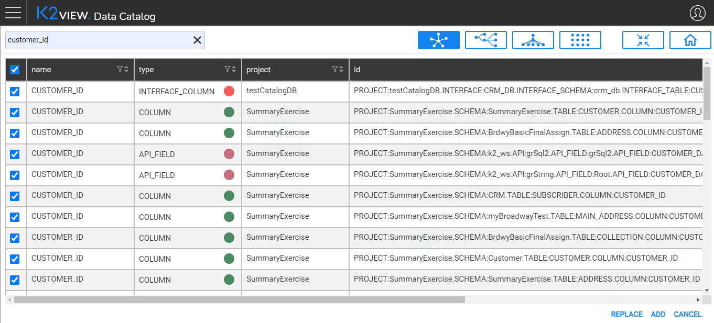
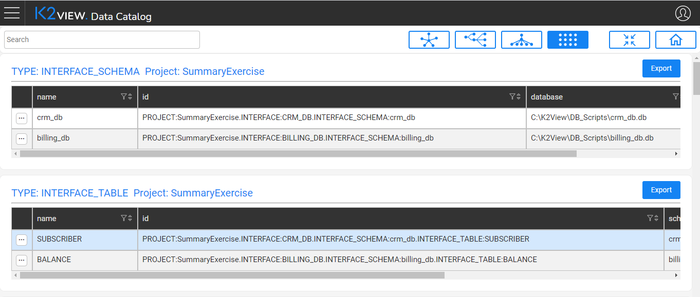

# Data Catalog Navigation

The Data Catalog user interface enables users to move from one level to another through a data model’s graph, as well as to filter specific elements.  

### How Do I Access the Data Catalog?

The Data Catalog is accessed from the [K2View Web Framework](/articles/30_web_framework/01_web_framework_overview.md). Select the **Data Catalog** application from the Web Framework context menu. A display showing a project deployed to the OrientDB database will appear. If multiple projects have been deployed to the same OrientDB database, all projects will be displayed.

### Data Catalog Legend

The Legend is displayed on the bottom right corner of the screen and provides a visual description of each component in the graph. The graph's data types can be split into the following categories:

<table style="width: 750px;">
<tbody>
<tr >
<td style="width: 150px;"><strong>Category</strong></td>
<td style="width: 200px;"><strong>Data Type</strong></td>
<td style="width: 400px;"><strong>Description</strong></td>
</tr>
<tr >
<td style="width: 120px;"><strong>Project</strong></td>
<td style="height: 18px; width: 226px;">PROJECT</td>
<td style="height: 18px; width: 308px;">Project name.</td>
</tr>
  <tr >
<td style="width: 120px;" rowspan="3"><strong>Target Components</strong></td>
<td style="width: 226px; height: 28px;">SCHEMA</td>
<td style="width: 308px; height: 28px;">

Project entity (LU, Web Services or Common).

</td>
</tr>
<tr>
<td style="width: 226px;">TABLE</td>
<td style="width: 308px;">

LU tables.

</td>
</tr>
<tr>
<td style="width: 226px;">API</td>
<td style="width: 308px;">

Web service and its fields.

</td>
</tr>

<tr >
<td style="width: 120px;"><strong>Source Components</strong></td>
<td style="height: 18px; width: 226px;">INTERFACE INTERFACE_SCHEMA INTERFACE_TABLE&nbsp;</td>
<td style="height: 18px; width: 308px;">Data source components.</td>
</tr>
<tr >
<td style="width: 120px;" rowspan="3"><strong>Connection Lines</strong> <strong> </strong><strong> </strong></td>
<td style="height: 18px; width: 226px;">CONTAINED</td>
<td style="height: 18px; width: 308px;">Indicates the data entity that holds the current entity. For example, if a table is contained in a Schema (LU).</td>
</tr>
<tr>
<td style="height: 16px; width: 226px;">USE</td>
<td style="height: 16px; width: 308px;">Indicates the data entity used by the current entity. For example, if a TABLE (LU table) uses an INTERFACE_TABLE.</td>
</tr>
<tr>
<td style="width: 226px;">POPULATION_KEYS</td>
<td style="width: 308px;">Indicates how the current table is populated in the LU schema. For example, when the relationship is ACTIVITY &gt; CUSTOMER, the ACTIVITY table is populated using the key from the CUSTOMER table.</td>
</tr>
</tbody>
</table>

Click icon in the Legend to hide / unhide data elements in the tree. 

### How Do I Navigate Through the Data Catalog?

The following tools are used to navigate the Data Catalog:

* Search the data element using the **Search** area in the top left corner of the screen. The search is performed using the *search-as-you-type* field type. The search results are presented in a table, enabling users to either add an entity to the tree or to replace the tree's focus to the selected entity.

  

* Change the tree view using the icons in the top right corner of the screen:

  

  * Click to display the tree  horizontally,  vertically or centered.
  * Click  to fit the tree to the screen.
  * Click  to return to the collapsed project.

* Move to a lower hierarchy level by double-clicking the data element or clicking the  icon  on the data element header: . The lower hierarchy level is then displayed.

  ​	

* By default, all tables are collapsed. To expand the tables, do the following:

  * Click theicon in the legend near the data element type. For example, when clicking the icon next to **Table** in the legend, all displayed tables are expanded, and the legend icon changes to:  .
  * Alternatively, click the same icon on the data element header: .

  

* Click any data element or connection line to display its properties, such as name, ID or type in the Properties screen. Click anywhere in the empty screen area to hide the Properties screen.

* To clear the node or the connection line, select the Hide option either from the Properties screen or from the right click context menu. 

* To clear multiple data elements, click and hold the mouse and then drag the line selecting the required elements.

  

* Click to switch from a tree view to a table view. The graph data is converted into a set of tables. Each table represents a data type with its properties. The table view enables exporting the data into Excel, changing the focus and displaying the links.

  

 
