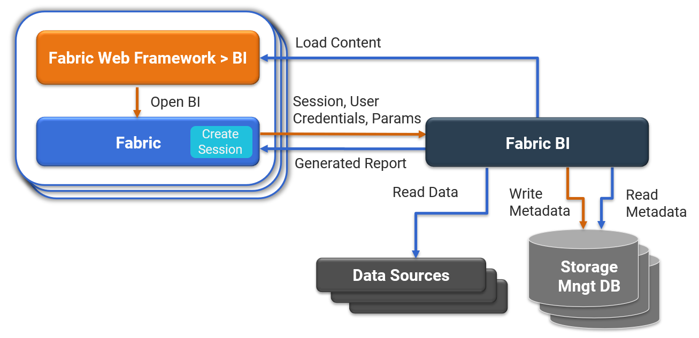

# BI Architecture Overview

Starting V6.5.3 Fabric includes a business intelligence application called **BI**. Fabric's BI enables the design and execution of reports and dashboards, and can connect to various data sources to read the data. The reports metadata is kept in an external Storage Management database. BI can be accessed via the [K2View Web Framework](https://support.k2view.com/Academy_6.5/articles/30_web_framework/01_web_framework_overview.html). The BI architecture is described in the following diagram:

 

The **BI** application includes the following modules:

* **Admin** - system configuration and initial setup module which enables the user to do the following: 

  - Create data sources and define their metadata (objects and joins).
  - Create parameters for applying a filter within reports.
  - Update various system configurations (advanced).

  Access to Admin is restricted based on the Fabric user role. The explanation about how to control access and define user roles is described at this [link](02_Permissions_Setup.md).

* **Designer** - content creation module which enables the user to do the following:

  * Create various types of reports and dashboards. 
  * Generate the reports / dashboards and download the extract files.

Reports can also be generated from Fabric user code. The way to do it is described at this [link](05_report_creation_guidelines.md). 

Note that access to the **Admin** module of **BI** is [restricted based on the user role](02_Permissions_Setup.md). The users that can access it, will see an **Admin** and **Designer** tab on the top left of the interface of the BI. Clicking one of these tabs will cause the relevant module's functionality to be displayed in the main window of the BI. Other users can only use the **Designer** module. They will not see these tabs on the top left of the interface, and as such, will only see the functionality of the **Designer** module in the main window. 

 
